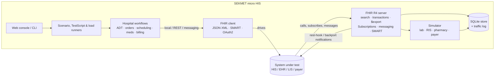

# SEKMET FHIR R4 Tester

**A micro hospital information system (HIS) that you can point at a real HIS, EHR, LIS, RIS or payer system to test
its FHIR R4 integration end to end.** SEKMET plays the *other side* of real hospital workflows: it acts as a
FHIR server that the system calls, as a FHIR client that drives it, and as a lab, radiology, pharmacy or payer
counterpart. It records every exchange and tells you exactly where the integration breaks.

[](https://github.com/KaRamHelal/SEKMET_FHIR_R4_Tester/actions/workflows/ci.yml)
[](https://pypi.org/project/sekmet-fhir/)
[](https://pypi.org/project/sekmet-fhir/)
[](LICENSE)


```bash
pip install sekmet-fhir
sekmet scenario run all --peer self      # 14 hospital scenarios against its own FHIR server, ~20 s
```


## The problem

You're integrating with a hospital system over FHIR: registration and ADT feeds, lab orders and results,
radiology, scheduling, pharmacy, claims, notifications. To test it properly you need **another hospital system**
that behaves realistically:
- it places orders and reports results,
- it books and cancels appointments,
- it subscribes to changes,
- it sends FHIR messages,
- it handles SMART Backend Services auth,
- and it survives concurrent load.

The usual options are poor:
- **Generic FHIR servers** (HAPI, Firely…) store resources, but they don't *act*: nothing fulfils your order
  or pays your claim.
- **Conformance suites** (Inferno, Touchstone) check the API against specifications, but not your hospital
  workflows.
- **Testing against a production partner** is slow, risky, and can't reproduce edge cases on demand.

SEKMET fills that gap. It's a small, scriptable, observable hospital system built only for testing FHIR
integrations.

## Who it's for

- **HIS/EHR vendors and integration teams** preparing an interface (ADT, orders/results, scheduling, pharmacy,
  billing) or a go-live.
- **Lab (LIS), radiology (RIS/PACS), pharmacy and payer system developers** who need a realistic placer or
  counterpart.
- **QA teams** who want repeatable FHIR regression tests in CI (JUnit output, exit codes, gates).
- **Implementers of FHIR features** (Subscriptions, Bulk Data, messaging, SMART) who want to test both the client
  and the server side.
- **Anyone evaluating a FHIR server:** "Does it really do what its CapabilityStatement says?"

## Use cases

| You want to… | SEKMET does… |
|---|---|
| Check a HIS can **register, admit, transfer and discharge** patients over FHIR | runs the ADT workflows against it and verifies Encounter status, location history, discharge disposition and searches |
| Test a **lab or radiology interface** | places ServiceRequest + Task, then either fulfils it itself (Specimen, Observations, DiagnosticReport, ImagingStudy) or waits for *your* system to result it |
| Test the HIS as a **filler** | your system sends orders to SEKMET, and the built-in **simulator** answers as lab, RIS, scheduler, pharmacy or payer |
| Validate **appointment booking**, **e-prescribing** or **claims** | Schedule/Slot/Appointment, MedicationRequest/Dispense/Administration, Coverage/ChargeItem/Claim/ClaimResponse flows |
| Test **notifications** | classic R4 rest-hook **and topic-based Subscriptions (R4 Backport IG)**, as publisher and as subscriber |
| Test **FHIR messaging** | ADT/order/result message Bundles to `$process-message`, with acknowledgements checked |
| Test **SMART Backend Services / OAuth2** | acts as the SMART client (signed JWT, or client secret for e.g. Keycloak) and as a SMART token server |
| Test **Bulk Data `$export`** | runs the async export end to end and validates every NDJSON line; also serves `$export` itself |
| Check **XML** as well as JSON | the whole scenario library can run over `application/fhir+xml` |
| Run existing **FHIR TestScripts** or produce **TestReports** | built-in TestScript engine; any run can be exported as a replayable TestScript |
| **Load test** before go-live | N parallel users run hospital journeys, with per-endpoint p95/p99, error rates and **correctness under concurrency**, gated for CI |
| See **exactly what went over the wire** | every request/response in both directions, correlated per test step, with secrets redacted |

## What's inside

- **FHIR R4 server:** CRUD, versioning, conditional operations, transactions with rollback, rich search
  (chaining, `_has`, `_include`/`_revinclude`, modifiers, prefixes, paging), JSON and XML, `$everything`,
  `$validate`, `$process-message`, `Claim/$submit`, `$export`, Subscriptions (rest-hook and Backport topics with
  `$status`). Auth: none, Basic, bearer, or SMART Backend Services with scopes, over HTTPS.
- **FHIR client and workflows:** about 40 hospital workflows (ADT, lab and imaging orders/results, scheduling,
  medications, clinical documentation, billing), with standard terminology (LOINC, SNOMED CT, RxNorm, HL7 v2
  event codes). They target the local store, a peer over REST, or a peer via FHIR messaging.
- **Scenario runner:** readable YAML with FHIRPath assertions. It skips steps a peer doesn't advertise
  (CapabilityStatement-aware), grades SHALL vs SHOULD, and reports to HTML, JSON and JUnit.
- **TestScript engine:** runs standard FHIR TestScripts (fixtures, variables, XPath/FHIRPath asserts, multi-server)
  and writes TestReports.
- **Load mode:** scenarios as user journeys, a guard against loading systems you don't own, and CI gates.
- **Web console:** dashboard, resources, workflow forms, scenarios, traffic inspector, peers, TestScripts, load,
  bulk, subscriptions, simulator, validator.

| | |
|---|---|
|  |  |
|  |  |

## Quick start

```bash
pip install sekmet-fhir                       # Python 3.11+
sekmet serve                                  # FHIR: http://localhost:8090/fhir   console: http://localhost:8090/ui
```

Point it at the system you want to test by adding a peer to `settings.yaml` (see
[config/settings.example.yaml](https://github.com/KaRamHelal/SEKMET_FHIR_R4_Tester/blob/main/config/settings.example.yaml)):

```yaml
peers:
  my-his:
    base_url: https://his.example.org/fhir/r4
    auth: {type: client_credentials, client_id: sekmet, client_secret_file: keys/my-his.secret,
           token_url: https://auth.example.org/realms/x/protocol/openid-connect/token}
```

```bash
sekmet peers test my-his                               # read-only: token + CapabilityStatement + gaps
sekmet scenario run conformance_smoke --peer my-his    # core REST behaviour
sekmet scenario run all --peer my-his                  # every hospital flow; reports in ./reports/
sekmet load run adt_admit_transfer_discharge --peer my-his -u 10 -d 60 --i-own-this-system --max-p95 1000
```

Write your own scenario:

```yaml
name: Admitted patient appears in the ward census
steps:
  - {action: adt.register_patient, save: reg}
  - {action: adt.admit, args: {patient: "${reg.patient.id}", bed: bed-401-1}, save: adm}
  - name: Census search
    request: {method: GET, path: Encounter, params: {status: in-progress, patient: "Patient/${reg.patient.id}"}}
    expect: {status: 200, fhirpath: ["Bundle.entry.resource.ofType(Encounter).id contains '${adm.encounter.id}'"]}
```

## How it compares

| | Plays hospital workflows | Acts as a counterpart system | Server under test | Client under test | Load / concurrency | Traffic inspector |
|---|---|---|---|---|---|---|
| **SEKMET** | ✓ ADT, orders, scheduling, meds, billing | ✓ lab/RIS/pharmacy/payer simulator | ✓ | ✓ (its server + simulator) | ✓ | ✓ |
| Inferno test kits | – (conformance to IGs) | – | ✓ | partly (proxy) | – | per test |
| Touchstone | – (TestScripts) | – | ✓ | ✓ | – | ✓ |
| HAPI / Firely servers | – (resource stores) | – | – | ✓ (as a target) | – | – |
| Synthea | synthetic records, not live exchange | – | – | – | – | – |

They complement each other: use Inferno or Touchstone for IG certification, and SEKMET for "does our integration
actually work, end to end, under load". SEKMET runs standard TestScripts too, so scripts move between tools.

## Tested against

The scenario library has run against **HAPI FHIR 8.x, Firely Server 6.x, Spark, WildFHIR, fhir-candle** (JSON and
XML) and the **Inferno SMART App Launch kit** (Backend Services). Every round found and fixed real issues, in SEKMET
and elsewhere. See the [testing log](https://github.com/KaRamHelal/SEKMET_FHIR_R4_Tester/blob/main/docs/testing-log.md)
and its peer behaviour matrix.

## Architecture



## Documentation

- [Operations guide](https://github.com/KaRamHelal/SEKMET_FHIR_R4_Tester/blob/main/docs/operations.md): installation,
  commands, configuration reference, auth, formats, Subscriptions, Bulk Data, TestScript, load testing,
  troubleshooting.
- [Scenarios](https://github.com/KaRamHelal/SEKMET_FHIR_R4_Tester/blob/main/docs/scenarios.md): scenario catalogue,
  authoring reference, portability rules learned from real servers.
- [Testing log](https://github.com/KaRamHelal/SEKMET_FHIR_R4_Tester/blob/main/docs/testing-log.md): what each test
  round against real servers found.

## Safety

SEKMET generates **synthetic data only**. Don't point write scenarios or load tests at production systems or at
systems holding real patient data. Load mode refuses non-local targets unless you pass `--i-own-this-system`. See
[SECURITY.md](https://github.com/KaRamHelal/SEKMET_FHIR_R4_Tester/blob/main/SECURITY.md).

## Contributing

Issues and pull requests are welcome, especially new scenarios, workflows, and findings from real systems (without
customer data). See [CONTRIBUTING.md](https://github.com/KaRamHelal/SEKMET_FHIR_R4_Tester/blob/main/CONTRIBUTING.md).

## License

[Apache-2.0](https://github.com/KaRamHelal/SEKMET_FHIR_R4_Tester/blob/main/LICENSE)

<sub>Keywords: FHIR R4 test harness · HL7 FHIR integration testing · HIS / EHR interoperability testing · FHIR mock
server · FHIR simulator · lab / radiology interface testing · FHIR Subscriptions backport · SMART Backend Services
testing · Bulk Data $export testing · FHIR TestScript runner · FHIR load testing</sub>
